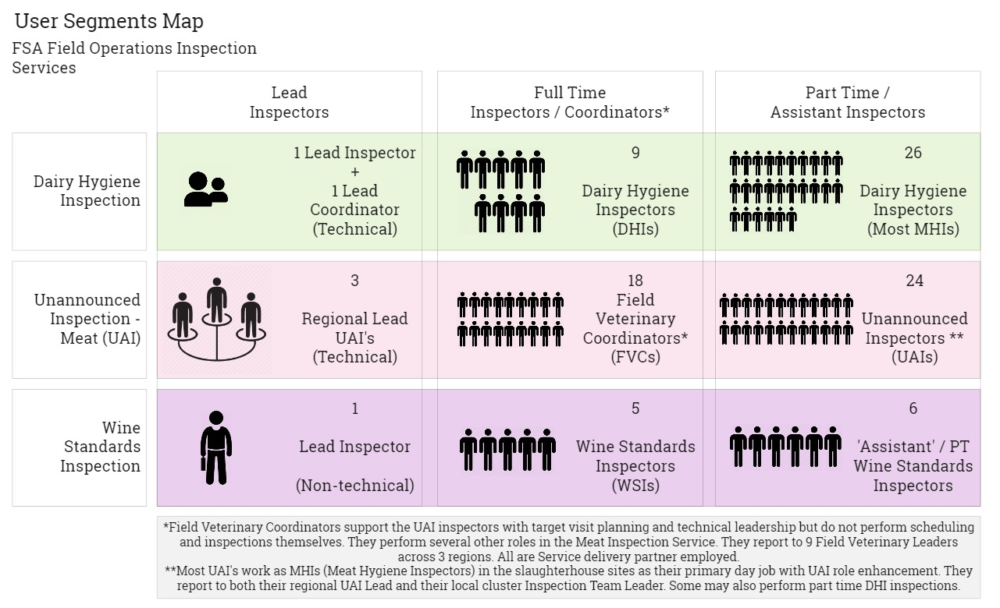

## User Segments

A recap of priority user segments identified for research, based on [stakeholder mapping](users-and-stakeholder#user-segments).

## Personas

These capture essential information about these users, their roles, skills, needs, goals, and specific pain points in the course of performing their roles.

Data was collected through 15 user interviews and 2 site visits was used to compile representative [user personas](user-research#about-personas). 

The Persona grid below contains summary User Needs. 

Comprehensive User Needs and goals for priority user segments are outlined below.

## User Needs
User needs are expressed in the following format: 

* As a… [which type of user has this need?]
* I need/want/expect to… [what does the user want to do?]
* So that… [why does the user want to do this?]

And optionally:
* When… [what triggers the user’s need?]
* Because… [is the user constrained by any circumstances?]

They aim to illustrate the underlying goals of the persona, with illustrative, as opposed to prescriptive solutions, since the same need might be met in a variety of ways. 

## As an <a name="inspector-needs">Inspector</a> I need:
_Common needs to all inspectors_

*   A single shared central planning and scheduling tool which integrates all triggers for inspections so that I can reduce time checking in multiple places and plan more efficient inspection schedules.
*   A centralised record of the FBO, containing all information held against them from multiple inputs, so that I can save prep time looking for this information and reduce errors by omission.
*   Standardised semi-structured guides and official forms so that I spend less time preparing for inspections and consistently conduct higher quality inspections.
*   Field tools that manage forms, reference documents and notes capture in a flexible way, so that I can deviate from the set inspection flow, capture evidence or quickly locate a key document as the inspection requires, and easily return to the core inspection flow.
*   Guidance and training on best practices for capturing evidence, so that inspections are consistently evidenced and enforcement action can be legally escalated with confidence where required.
*   An inspection record/capture method that forms the basis of or replaces the final inspection report, so that I save significant time writing notes, reports and issuing letters.
*   Standardised means and formats of issuing enforcement notices, so that there is one type of efficient workflow to follow in all cases.
*   A centralised record of the FBO, where reporting in all formats is stored, so that future preparation work is complete and found in one location.
*   A way of tracking open and historic enforcements against each FBO and follow up activity triggers that speaks to the same single shared central planning and scheduling tool as routine inspections, so that public health risks are fully managed going forwards.
*   A simple way to record inspection progress and effort (completed work, time, expenses), so that I save time on administrative tasks and my team leader has easy visibility of my activity. 

## As a <a name="dhi-needs">Dairy Hygiene Inspector (DHI)</a> I need:

*   View upcoming inspections due by Dairy regional boundaries OR Meat inspections clusters, so that I can identify upcoming inspection work that applies to me, without having to make geographical conversions.
*   Easily manage the correct priority of visits from one tool, so that I don’t have to check in multiple places (email, RCDM tracker) to identify the most urgent inspections. 
*   Tools that help me efficiently cluster adjacent upcoming inspection targets so that I travel efficiently and save time and money driving long distances from home.
*   A means of recording inspections that improves on the accuracy and reliability of the Anoto DigiPen so that I save time correcting illegible handwriting later.
*   An integrated means of taking and storing photographic evidence against an inspection record, so that I don’t have to remember to take them and later upload and store them manually in appropriate locations.
*   A means of producing the report ‘as you go’ so that the requirement for post inspection reporting goes down and turnaround for FBO is sped up.
*   Easy to hand specific and accurate guidance and legislative materials in the field, so that I can show a farmer what requirement they have not met and how they can improve.
*   A means of quickly or automatically locating relevant and up to date legislation content for inclusion in my enforcement report (DH1), so that I can save time on report turnaround and avoid errors.

## As an <a name="uai-needs">Unannounced Inspector - Meat (UAI)</a> I need:

*   An efficient, transparent communication mechanism between me, the FVC, UAI lead and my ITL, so that I can effectively manage demands on my time and my leaders can see my workload.
*   To be able to pick up allocated visits and schedule them quickly so that I can fit unannounced inspection work around my other day job efficiently.
*   Streamlined access to complete prep materials all in one place so that I can quickly gain the background I need to focus my inspection without having to look in multiple locations or risk missing something.
*   Standardised inspection capture tools and observation recording methods so that my work is complete and accurate (I don’t miss something).
*   A flexible inspection capture tool that allows me to jump around, so that I can react to capture infractions as they present themselves without losing flow.
*   Transferable field notes that form the basis for reporting so that I reduce time spent double handling/collating information from various sources or memory afterwards.
*   A consistent and efficient means of issuing in-person enforcement notices so that I don’t need to prep them ahead or carry a wide variety of forms to inspections.
*   Streamlined reporting tools and outputs so that I can save time writing up the inspection and easily issue the right thing to the right person without duplicating effort.
*   Autonomy to author and complete inspection reports without needing FVC review OR smarter tooling to share a single live document with appropriate authorship controls, so that I save me and them time in back and forth corrections. 

## As a <a name="fvc-needs">Field Veterinary Coordinator (FVC)</a> I need:

*   Closer working relationships and visibility with ITLs and UAI leads who share MHI/UAI resource, so that I can anticipate and avoid bottlenecks in capacity. 
*   A centralised place to assess incoming urgent actions against routinely due actions, so that I can avoid looking in multiple places (email, k2, trackers) when deciding what work to prioritise.
*   A one-stop-system for all intelligence held about a given FBO so that I can quickly make planning decisions and scheduling allocations.
*   Closer working visibility of the Audit team activity (e.g. blended or shared repositories and live scheduling tools) so that we can align effort and avoid duplication.
*   A simplified report checking and sign off workflow, so that FBO’s receive enforcement letters in a timely manner and I save time for my other workloads.

## As a <a name="wsi-needs">Wine Standards Inspector (WSI)</a> I need:

*   A central planning tool which is filterable by my region and always displays current FBO inspection status, so that my colleagues don’t have to produce this for me or ask me for periodic updates on progress.
*   A streamlined way to communicate with FBO re: scheduling their availability for inspection visits (e.g. diary/appointment manager) so that I can manage expectations around cancellation and avoid communication overheads.
*   Preparatory field materials that are easily customisable based on the FBO type (trader vs. vineyard), so that I’m not spending as much time routinely compiling tailored paperwork packs before inspections.
*   To be able to confidently signpost FBO’s to an accurate self service public repository of up to date information appropriate to their goal, so that I can reduce the volume or tailored one to one guidance I must provide.
*   An easy way to scale enforcement materials that may apply very similarly to a large number of FBOs so that I don’t spend hours compiling individual notices (eg, following a bonded warehouse inspection.)
*   To only have to log my time and expenses once in one system that speaks to others, so that I can save time on low value administrative tasks.
*   (Lead WSI) Real time visibility of inspection progress and status of each FBO across regions and inspectors, so that I have accurate up to date information without requiring inspectors to compile monthly offline reports.

## As a <a name="lead-needs">Lead Inspector (Dairy / UAI / Wine)</a> I need:

*   A centralised resource planning  that spans mine and other inspection services related to the FBO, so that I can be confident adjacent internal teams and external partners are working together efficiently.
*   Time and focus to produce and maintain standardised guidance and training to inspectors so that inspection work remains effective, consistent and meets legislative requirements.
*   Time and focus and create or influence industry facing guidance and resources, so that advice to industry is current, trusted, meets legislative requirements and promotes a culture of compliance vs. enforcement.
*   Systems that provide accessible and current management information (such as progress reports, time spent) so that I can plan resources, manage priorities and provide other colleagues with statistical information about inspections and enforcement.
*   Technology and process development support that works closely with inspection teams, so that the right problem is solved and the desired change is smoothly adopted.