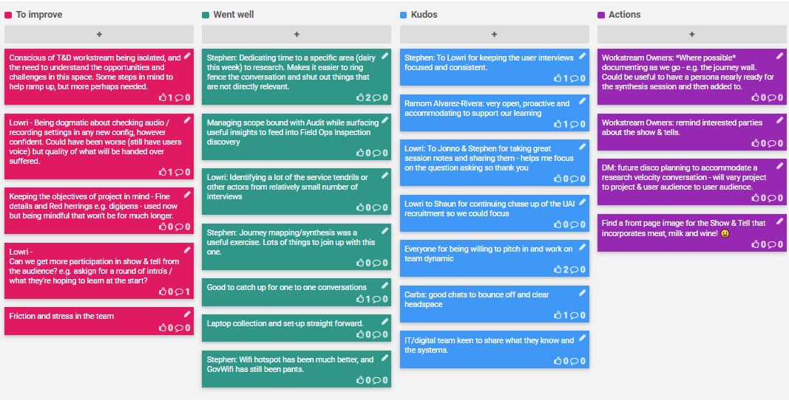

A retrospective is a ceremony held by an agile team at the end of each sprint to openly discuss what is going well and what needs improvement. It's a key activity to help the team iteratively improve their working culture.

## [Sprint 1 (27-31 Jan)](Sprint-1-Retrospective)

## [Sprint 2 (3-7 Feb)](Sprint-2-Retrospective)

## [Sprint 3 (10-14 Feb)](Sprint-3-Retrospective)

## [Sprint 4 (17-24 Feb)](Sprint-4-Retrospective)

## [Sprint 5 (24-28 Feb)](Sprint-5-Retrospective)

## [Sprint 6 (2-6 Mar)](Sprint-6-Retrospective)

## [Sprint 7 (9-13 Mar)](Sprint-7-Retrospective)

## [Full Discovery Retrospective](Discovery-Retrospective)
