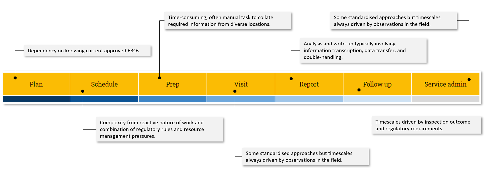

## Understand the service timeline

The service timeline gives a high-level view of the end-to-end process of inspections as delivered by Field Operations. It presents the lifecycle of processes and tasks with a service design lens. This breaks the process into a series of stages, that enables business objectives, operates the key deliverable of assuring FBO compliance with food safety regulations, and with continuous improvement to manage and maintain delivery of inspections efficiently.

The timeline is based on the user journey stages which have been identified as common across Dairy, Meat and Wine inspections. The following list includes typical activities at each stage:

### Plan
Assessing what activities are needed in order to deliver the required job to be done in order to enable the <key stakeholder> to meet their business objectives and operate at the proposed volumes.

### Schedule
Putting together a practical plan for delivering inspections and allocating time and resources in line with regulatory requirements.

### Prep
Collating, reading and assessing all available and relevant information about a Food Business Operator prior to an inspection or other visit to refresh or build an understanding of the business, its operations, any previous inspection notes and enforcements, and its current status.

Organise all required technical and practical equipment needed to conduct the visit.

### Inspect
Conduct the required inspection appropriate to the type of Food Business Operator and the nature of its operations.
Document observations and findings.
Document any non-compliance and gather evidence as required.
Issue required notices for any non-compliances and take

### Report
Collate and analyse all notes made during the visit and transcribe or create a written report of the inspection.

### Follow up
Monitor and track non-compliance and improvement actions.
Schedule and carry out follow-up visits (as required).
Log inspection work completed for charging purposes (where required).
Log inspection work completed for time tracking purposes (where required).
Log expenses (where applicable).

### Service admin
Complete daily, weekly and scheduled tasks required to operate inspections.
Maintain processes and procedures, documentation and guidance for inspectors and stakeholders.
Engage stakeholders and provide required information.

***

## Timeline analysis
At each stage in the timeline there are clearly identifiable pressure points that are common, to varying degrees, across all inspection teams. These pressures are caused by: dependencies on other teams and/or available information; time constraints; complexity of regulation and business rules that determine inspection scheduling; and time lost to duplication of effort or double-handling.

### Plan
The key dependency for longer-term planning of inspection visits is having a current and accurate list of approved FBOs. For meat and dairy this comes via the Registrations & Approvals team. For wine, the list is maintained by the inspection team themselves.

### Schedule
The Schedule stage is by considerable margin the most complex, time-consuming, and frequently changing part of the timeline. 

Scheduling must take into account the regulatory requirements that determine visit type and frequency. In each of dairy, meat and wine, there is a complex set of policy-driven frequencies with FBOs scored by category and risk.

Scheduling is typically impacted by the outcome of inspections, not only those conducted by the Field Operations teams but also inspections, audits and checks carried out by other agencies and bodies in the food safety chain. For example, Trading Standards for wine; Red Tractor Assurance for dairy; and Local Authorities for meat.

Scheduling is then impacted further by any enforcements or prohibitions which require additional visits over a given period of time.

For dairy and wine in particular, the use of Meat Hygiene Inspectors on a part-time basis for dairy hygiene and wine standards inspections means their schedules can be exposed to late changes when there is demand from the meat inspection service to pull staff back in.

Although scheduling takes place well in advance of visits, the reality is that schedules are finalised very close to the week of inspections and can be altered at very short notice.

This means that the schedule is under constant review and needs the flexibility to change and for inspectors to be notified.

At present scheduling across the teams is a mix of some system based ranking tools and manual data input. There is no real workflow or automated workflow management based on business rules and conditions in use.

### Prep
Preparing for a visit is typically a time-consuming, often manual task to collate required information from diverse locations. This eats into the time available to conduct visits and complete reporting and follow up. Although 'getting to know the FBO you're going to inspect' is a valuable and essential part of the inspection process, it is not productive time in terms of actual inspection in the field. Collating the required information, rather than consuming it, is the particular time constraint here.

### Visit
Inspection visit times varies enormously and is dependent on the type of FBO being inspected and the nature of their operations. Visit time can become extended where findings and non-compliance notices must be written up to be left with the FBO before leaving the premises. 

Visit time can also be constrained by the need to travel to and between locations which can be geographically dispersed.

### Report
Analysis and write-up typically involving information transcription, data transfer, and double-handling. There is no consistency between the inspection teams in how reports are captured, transcribed, produced, or signed-off.

The report process can also involve either technical leads or editorial business support teams reviewing and rejecting reports which inspectors must then make time to correct.

### Follow up
It is very difficult to model or generalise about follow up time. The actions required and time taken are driven by inspection outcome and regulatory requirements and vary enormously.

### Service admin
The additional time needed by inspection leads and their teams to operate the service is largely unrecorded and not captured in previous research. There are large number of additional tasks, initiatives and projects that inspection team members undertake both as part of their working week and outside hours through goodwill. 

These are the administrative, knowledge management, knowledge transfer, process improvement and other activities that keep the show on the road and often create a sense of team membership.