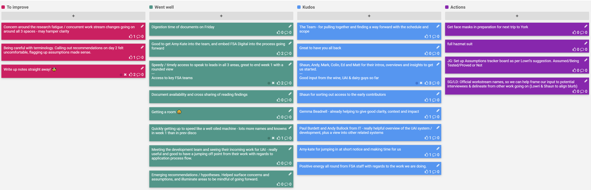

## 27-31 Jan 2020

## Actions

- [ ] JG: Set up Assumptions tracker board
- [ ] SG/LD: Align blurb / messaging to frame discovery work and send out to interviewees

## To improve 

* Concern around the research fatigue / concurrent work stream changes going on around all 3 spaces - may hamper clarity
* Being careful with terminology. Calling out recommendations on day 2 felt uncomfortable, flagging up assumptions made sense.
* Write up notes straight away! 🤯

## Went Well

* Digestion time of documents on Friday
* Speedy / timely access to speak to leads in all 3 areas, great to end week 1 with a rounded view
* Access to key FSA teams
* Good to get Amy-Kate into the team, and embed FSA Digital into the process going forward
* Document availability and cross sharing of reading findings
* Getting a room 😀
* Quickly getting up to speed like a well oiled machine - lots more names and knowns in week 1 than in prev disco
* Meeting the development team and seeing their incoming work for UAI - really useful and good to have a jumping off point from their work with regards to application process flow.
* Emerging recommendations / hypotheses. Helped surface concerns and assumptions, and illuminate areas to be mindful of going forward.

## Kudos

* The Team - for pulling together and finding a way forward with the schedule and scope. Great to have you all back.
* Gemma Beadnell - already helping to give good clarity, context and impact.
* Shaun for sorting out access to the early contributors.
* Shaun, Andy, Mark, Colin, Ed and Matt for their intros, overviews and insights to get us started.
* Good input from the wine, UAI & dairy guys so far.
* Paul Burdett and Andy Bullock from Application Support - really helpful overview of the UAI system / development, plus a view into other related systems.
* Amy-Kate for jumping in at short notice and making time for us.
* Positive energy all round from FSA staff with regards to the work we are doing.
