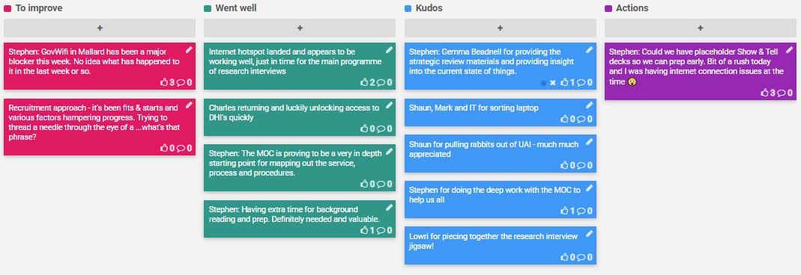

## 3-7 Feb 2020

## Actions

- [x] JG: Earlier access to Show & Tell decks. 
  - Intention is to release placeholder for following week after Show & Tell

## To improve 

* GovWifi in Mallard has been a major blocker this week. No idea what has happened to it in the last week or so.
* Recruitment approach - it's been fits & starts and various factors hampering progress. Trying to thread a needle through the eye of a ...what's that phrase?

## Went Well

* Internet hotspot landed and appears to be working well, just in time for the main programme of research interviews
* Charles returning and luckily unlocking access to DHI's quickly
* Stephen: The MOC is proving to be a very in depth starting point for mapping out the service, process and procedures.
* Stephen: Having extra time for background reading and prep. Definitely needed and valuable.

## Kudos

* Gemma Beadnell for providing the strategic review materials and providing insight into the current state of things.
* Shaun, Mark and IT for sorting laptop
* Shaun and Mark for pulling rabbits out of UAI - much much appreciated
* Stephen for doing the deep work with the MOC to help us all
* Lowri for piecing together the research interview jigsaw!
