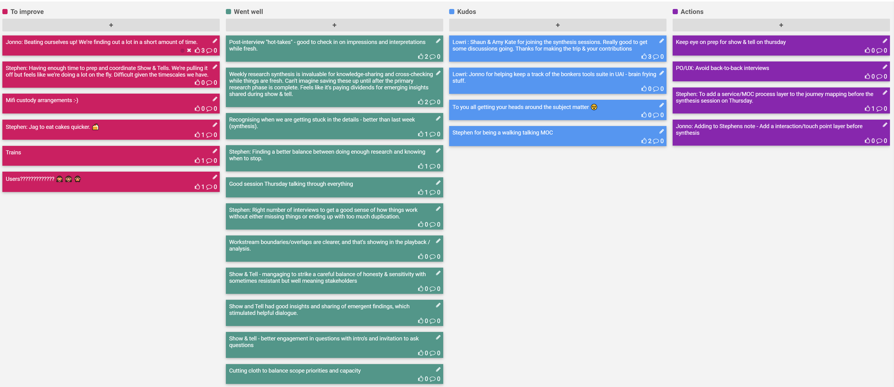

## 17-21 Feb 2020

## Kudos

- Shaun & Amy Kate for joining the synthesis sessions. Really good to get some discussions going. Thanks for making the trip & your contributions
- Jonno for helping keep a track of the bonkers tools suite in UAI - brain frying stuff.
- To you all getting your heads around the subject matter  😵
- Stephen for being a walking talking MOC

## Went well

- Post-interview "hot-takes" - good to check in on impressions and interpretations while fresh.
- Weekly research synthesis is invaluable for knowledge-sharing and cross-checking while things are fresh. Can't imagine saving these up until after the primary research phase  is complete. Feels like it's paying dividends for emerging insights shared during show & tell.
- Recognising when we are getting stuck in the details - better than last week (synthesis).
- Finding a better balance between doing enough research and knowing when to stop.
- Good session Thursday talking through everything
- Right number of interviews to get a good sense of how things work without either missing things or ending up with too much duplication.
- Workstream boundaries/overlaps are clearer, and that's showing in the playback / analysis.
- Show & Tell - mangaging to strike a careful balance of honesty & sensitivity with sometimes resistant but well meaning stakeholders
- Show and Tell had good insights and sharing of emergent findings, which stimulated helpful dialogue.
- Show & tell - better engagement in questions with intro's and invitation to ask questions
- Cutting cloth to balance scope priorities and capacity

## To improve

- Beating ourselves up! We're finding out a lot in a short amount of time.
- Having enough time to prep and coordinate Show & Tells. We're pulling it off but feels like we're doing a lot on the fly. Difficult given the timescales we have.
- Mifi custody arrangements :-)
- Jag to eat cakes quicker. 🍰
- Trains
- Users????????????? 🙈 🙉 🙊

## Action items

- PO/UX: Avoid back-to-back interviews
- [ ] Keep eye on prep for show & tell on thursday
- [ ] Stephen: To add a service/MOC process layer to the journey mapping before the synthesis session on Thursday.
- [ ] Jonno: Add a interaction/touch point layer before synthesis
