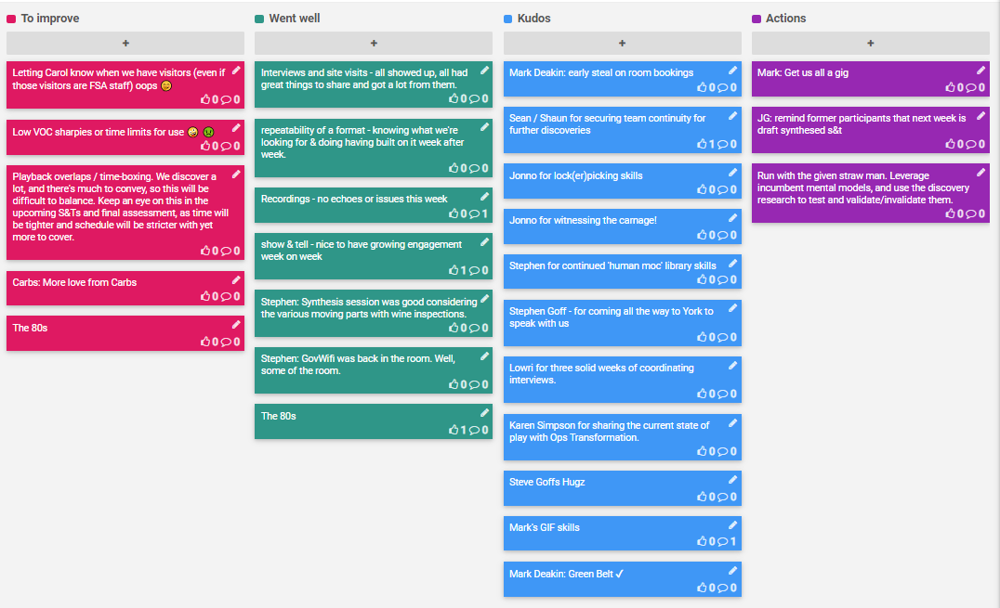

## 24-28 Feb 2020

## Kudos

- Mark Deakin: early steal on room bookings
- Sean / Shaun for securing team continuity for further discoveries
- Jonno for lock(er)picking skills
- Jonno for witnessing the carnage!
- Stephen for continued 'human moc' library skills
- Stephen Goff - for coming all the way to York to speak with us
- Lowri for three solid weeks of coordinating interviews.
- Karen Simpson for sharing the current state of play with Ops Transformation.
- Steve Goffs Hugz
- Mark's GIF skills
- Mark Deakin: Green Belt ✔Run with the given straw man. Leverage incumbent mental models, and use the discovery research to test and validate/invalidate them.

## Went well

- Interviews and site visits - all showed up, all had great things to share and got a lot from them.
repeatability of a format - knowing what we're looking for & doing having built on it week after week.
- Recordings - no echoes or issues this week
  - headphones ftw!
- show & tell - nice to have growing engagement week on week
- Stephen: Synthesis session was good considering the various moving parts with wine inspections.
- Stephen: GovWifi was back in the room. Well, some of the room.
- The 80s

## To improve

- Playback overlaps / time-boxing. We discover a lot, and there's much to convey, so this will be difficult to balance. Keep an eye on this in the upcoming S&Ts and final assessment, as time will be tighter and schedule will be stricter with yet more to cover.
- Letting Carol know when we have visitors (even if those visitors are FSA staff) oops  🤭
- Low VOC sharpies or time limits for use 🤪 🤢
- Carbs: More love from Carbs
- The 80s 

## Action items

- Run with the given straw man. Leverage incumbent mental models, and use the discovery research to test and validate/invalidate them.

- [ ] JG: remind former participants that next week is draft synthesed s&t
- [ ] MD: Get us all a gig