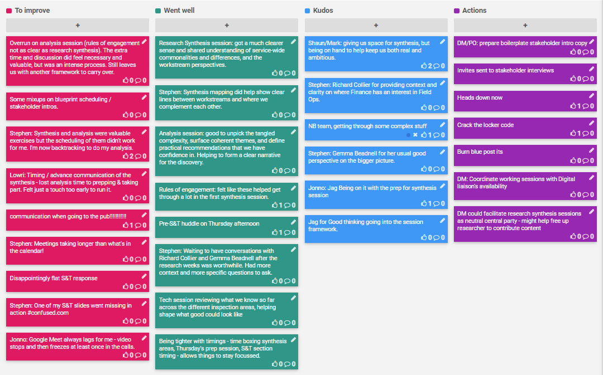

## 2-6 Mar 2020

## Kudos

- Shaun/Mark: for giving us space for synthesis, but being on hand to help keep us both real and ambitious.
- Richard Collier: for providing context and clarity on where Finance has an interest in Field Ops.
- NB team for getting through some complex stuff
- Gemma Beadnell for her usual good perspective on the bigger picture.
- Jag for being on it with the prep for synthesis session
- Jag for good thinking going into the session framework.

## Went well

- Research Synthesis session: got a much clearer sense and shared understanding of service-wide commonalities and differences, and the workstream perspectives.
- Synthesis mapping did help show clear lines between workstreams and where we complement each other.
- Analysis session: good to unpick the tangled complexity, surface coherent themes, and define practical recommendations that we have confidence in. Helping to form a clear narrative for the discovery.
- Rules of engagement: felt like these helped get through a lot in the first synthesis session.
- Pre-S&T huddle on Thursday afternoon
- Waiting to have conversations with Richard Collier and Gemma Beadnell after the research weeks was worthwhile. Had more context and more specific questions to ask.
- Tech session reviewing what we know so far across the different inspection areas, helping shape what good could look like
- Being tighter with timings - time boxing synthesis areas, Thursday's prep session, S&T section timing - allows things to stay focussed.

## To improve

- Overrun on analysis session (rules of engagement not as clear as research synthesis). The extra time and discussion did feel necessary and valuable, but was an intense process. Still leaves us with another framework to carry over.
- Meetings taking longer than what's in the calendar!
- Synthesis and analysis were valuable exercises but the scheduling of them didn't work for me. I'm now backtracking to do my analysis.
- Timing / advance communication of the synthesis - lost analysis time to prepping & taking part. Felt just a touch too early to run it.
- Some mixups on blueprint scheduling / stakeholder intros.
- Communication when going to the pub!!!!!!!!!!!
- Disappointingly flat S&T response
- Stephen: One of my S&T slides went missing in action  #confused.com
- Jonno: Google Meet always lags for me - video stops and then freezes at least once in the calls.

## Action items

- DM/PO: prepare boilerplate stakeholder intro copy
- DM: Coordinate working sessions with Digital liaison's availability
- DM: could facilitate research synthesis sessions to help free up user researcher to contribute content
- [ ] Invites sent to stakeholder interviews
- [ ] Heads down now
- [ ] Crack the locker code
- [ ] Burn blue post its
