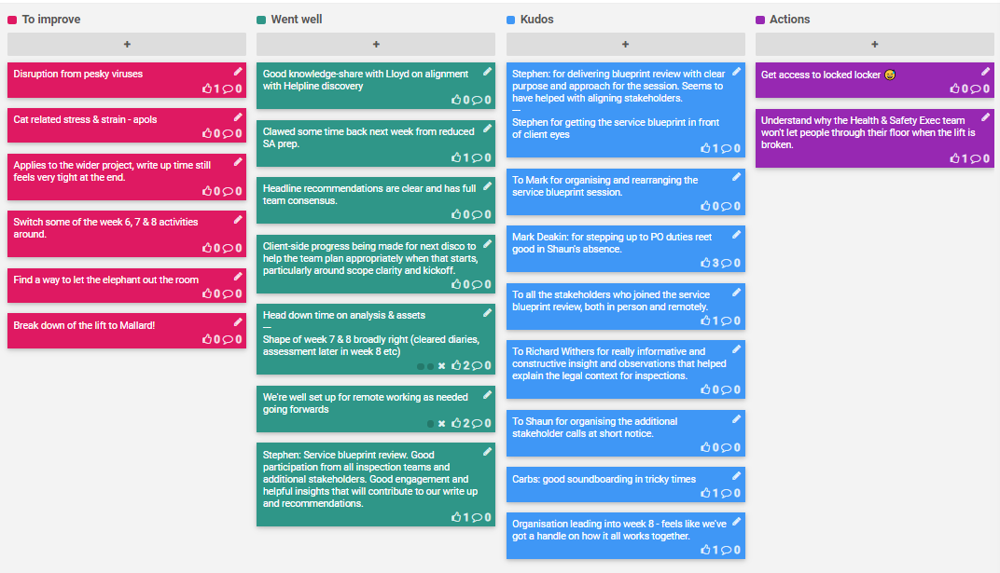

## 9-13 Mar 2020

## Kudos

- Stephen: for delivering blueprint review with clear purpose and approach for the session. Seems to have helped with aligning stakeholders.
- Stephen: for getting the service blueprint in front of client eyes
- Mark: for organising and rearranging the service blueprint session. 
- Mark Deakin: for stepping up to PO duties reet good in Shaun's absence.
- All the stakeholders who joined the service blueprint review, both in person and remotely.
- Richard Withers: for really informative and constructive insight and observations that helped explain the legal context for inspections.
- Shaun: for organising the additional stakeholder calls at short notice.
- Carbs: for good soundboarding in tricky times
- Jag: for organisation leading into week 8 - feels like we've got a handle on how it all works together.

## Went well
- Good knowledge-share with Lloyd on alignment with Helpline discovery
- Clawed some time back next week from reduced SA prep.
- Headline recommendations are clear and has full team consensus.
- Client-side progress being made for next disco to help the team plan appropriately when that starts, particularly around scope clarity and kickoff.
- Head down time on analysis & assets
- Shape of week 7 & 8 broadly right (cleared diaries, assessment later in week 8 etc)
- We're well set up for remote working as needed going forwards
- Service blueprint review. Good participation from all inspection teams and additional stakeholders. Good engagement and helpful insights that will contribute to our write up and recommendations. 

## To improve

- Disruption from pesky viruses
- Cat related stress & strain - apols
- Applies to the wider project, write up time still feels very tight at the end.
- Switch some of the week 6, 7 & 8 activities around.
- Find a way to let the elephant out the room
- Break down of the lift to Mallard!

## Action items

- [ ] Get access to locked locker  😅
- [ ] Understand why the Health & Safety Exec team won't let people through their floor when the lift is broken.