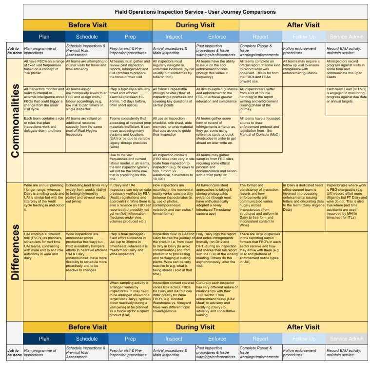

## Individual User Journeys

User journey mapping for each of the three inspectorates has been detailed here for 

- [Dairy](dairy-user-journey)
- [Unannounced Inspections (UAI)](unannounced-inspection-user-journey) 
- [Wine](wine-user-journey)

## Comparing User Journeys
These individual and granular journeys were then reviewed and synthesised into the user journey comparison chart below. 

**This analysis highlights;**

***Commonalities*** 

 * Where inspection tasks, contexts or pain points are similar or shared across inspectorates

***Differences***

 * Where the inspection tasks, contexts or pain points in one or more inspectorate could be considered more unique and divergent to each other

Comparison has been structured along the task flow steps (plan, schedule, prepare etc.) which are robustly consistent across each inspection journey.

_This image may be downloaded for closer inspection._

## Analysis & Commentary
### Journey Comparison Highlights

We have mapped each service individually in a typical user journey fashion with tasks, needs, pain points and opportunities.

Here we have pulled those together to focus most on what is common and what is different starting with what is common.

You’ll see the user journey flow spans the full cycle of the inspection work from planning to write up.

#### Key Commonalities

*   All are attempting to schedule for efficiency
*   All are following a repeatable flow and content (reliant on script or guide)
*   All suffer ‘Too many places to look’ and double handling of information 
    (inefficient prep & write up)
*   All teams Leads have a Management Information need

#### Key Differences

*   One inspectorate is announced, this adds specific needs in scheduling
*   There are key variances in the FBO contexts of inspections, therefore forms and content of inspections cannot be fixed.
*   Formality and consistency of documentation varies widely across inspectorates.
*   FBO-FSA culture varies enormously (Enforcement vs. Guidance/Advisory service)

## Overall Conclusions

**Similarities in core task, differences in execution:**

*   Day to day all follow a broadly similar set of steps and task flows.
*   Tooling varies considerably in each domain but needn’t.
*   All burdened with a proliferation of tools  & ‘too many places to look’.
*   Context does vary and tools must be flexible. Analogue has a place. Forms must scale to FBO site.

**Team structures can impact efficiency and consistency of inspection:**

*   There more hand offs and reporting lines are present, the more pain points & error potential
*   A nominated technical lead is an advantage = Reduced inconsistency in ways of working.
*   Part time roles support full time well at small scale, but don’t scale well & naturally feel scheduling & reporting line tensions.

**Digital literacy and adoption of new tooling is mixed:**

*   Those arriving from field ops roles require clear and streamlined tech, but adapt to a flawed suite. 
* Those with more office experience develop proliferate personal workarounds.
*   Approach to data storage and handling requires training to protect data integrity.

## Recurring Observations
*   Lack of visibility into in flight work - all on emails & paper & drives, makes it hard to manage or substitute at short notice
*   Different ways of launching or navigating to the same tools or information (e.g. bookmarks), grow out of date or unaware of all tooling
*   Frequent asset revisions (forms, guidance, MOC, crib sheet etc.) plus non-central storage practices and bulk printing = risk of using out of date assets.
*   Porous file naming & versioning conventions, behaviours are inconsistent and/or legacy led
*   FBO contact with inspector, or details sharing as point of contact is inconsistent - unclear where they should direct queries or info
*   Photos play several roles; 1 - evidence, 2 - aide memoire for later reporting, 3 - comms to the next inspector
*   Variable approach to FBO relationship, hostile to receptive (FBO) enforcing to advising/guiding (inspector)
*   Motivated to save money / be efficient with travel and time, but it is a very manual effort to achieve this (cost in inspector time)
*   Approach to legal records is inconsistent or poorly utilised or understood.
*   No guarantee scheduled visits will occur as planned, may need to flex, shift or roll over - any scheduling tool needs to accommodate this.
*   All services require a physical 'pack' of materials, forms and paper to take out with then on inspections
*   A lack of training and / or education for tools: - DB/Access, Photos, Notebooks
*   All require or would like to have some means of providing FBO's with relevant guidance in the moment.
*   Unstructured approaches to covering off 'core' inspection elements - leading to inconsistency between inspectors
*   Too many sources to refer to / tabs to have open to complete basic plan, prep & reporting tasks
*   Human resourcing competition between stakeholders and inspection services add pain. The additional line management by ITL's and FVC's is a necessary but costly relationship
