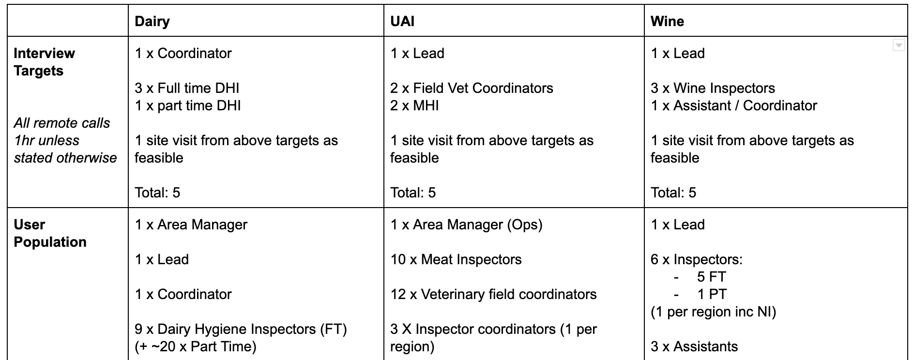

User research is conducted to understand

- How key roles interact with the service
- What their goals with the service are
- Context and cultural attributes
- Tools and technical requirements
- Pain points and frustrations
- Opportunities to improve the service

Outputs include [personas](#about-personas) and user journey maps (highlighting core tasks, pain points and opportunities) and [user needs](#about-user-needs).

## Research Methods

### Identifying users

Core user groups were initially mapped in workshops with input from the Inspection Team Leaders.

Those identified for research were selected on the basis of proximity to the day to day inspection work and significant influence over day to day operations:

* Leads or Coordinators (at least 1 interview)
* Primary Inspector (at least 4 interviews)
* Secondary Inspector (e.g. assistant / part time) (at least 1 interview)

### Methods used

- 1 on 1 remote interviews with video screenshare
- Site visit / shadowing

The primary method was 1 on 1 remote interviews, as these would allow the most visibility into the pre and post inspection workflow and tooling from the home office context the tasks are performed in. Users were able to share their screen and walk us through the systems and tools they routinely navigate for a large chunk of the end to end inspection work.

Site visits, as a secondary method, allowed us to observe in person the context and tools in use during the inspection itself. This provided an appreciation for the real world factors and pain points the inspector is having to navigate as they conduct inspections.

A user research script, or discussion guide, used for remote interviews can be found [here](uploads/User_Research_Script_-_Field_Ops_Inspections.pdf).

### Target Interview Quotas

### Research Schedule

Discrete weeks for research were dedicated to each inspection strand.

* Week 3 - Dairy Hygiene Inspectors
* Week 4 - Unannounced Inspectors
* Week 5 - Wine Inspectors

Each week began with research (Monday, Tuesday, Wednesday) followed by team synthesis sessions on Thursdays and documentation on Fridays.

This was a conscious scheduling approach in order to achieve clear insights and conclusions without the distraction (and potential for contamination) of running the 3 strands in parallel. This provided clear thinking space and the opportunity to compare services coherently week to week.

## User consent

Each user gave verbal consent for their remote interview to be recorded. It was agreed footage and comments were only to be shared within the immediate project team and that views or conclusions would be provided back to the FSA in aggregate anonymised form, so as to promote open and honest feedback. 

Particular care was taken in reporting back our analysis due to the small total user groups, which may risk partial inferred attribution. 

Copies of templates and forms supplied to us by interviewees that contained either their details or FBO sensitive data are similarly help on file by Not Binary, but may be redacted to preserve data privacy.

## About Personas

Personas are behavioural archetypes that illustrate fictional individuals from key user segments. They are evidence driven, combining insights from across all research participants within a segment and are not a representation of any one individual.

Design personas capture:
* Personal profile, role, attitudes and behaviours.
* Tools, skills and context of use.
* Tasks, motivations and goals.
* Key pain points and barriers with the task, tool or service

Personas are intended as a design tool and reference point, to support and inform a user centric approach to solving key service challenges. By keeping the attributes of different audience groups visible and front of mind, the design and service team can ensure they remain focussed on end user realities and goals. 

They inform and support reflective critique of work-in-progress (designs or builds).
They should evolve as the project progresses and more is learned about each one and further sub-personas may emerge.

## About User Needs

User needs are expressed in the following format;

- As a … [which type of user has this need?]
- I need/want/expect to … [what does the user want to do?]
- So that … [why does the user want to do this?] 

Ands Optionally:
- When … [what triggers the user’s need?]
- Because … [is the user constrained by any circumstances?]

They aim to illustrate the underlying goals of the persona, with illustrative, as opposed to prescriptive solutions, since the same need might be met in a variety of ways.

They should evolve as the project progresses and more is learned about underlying motivations e.g. in response to potential solutions in prototyping exercises.
