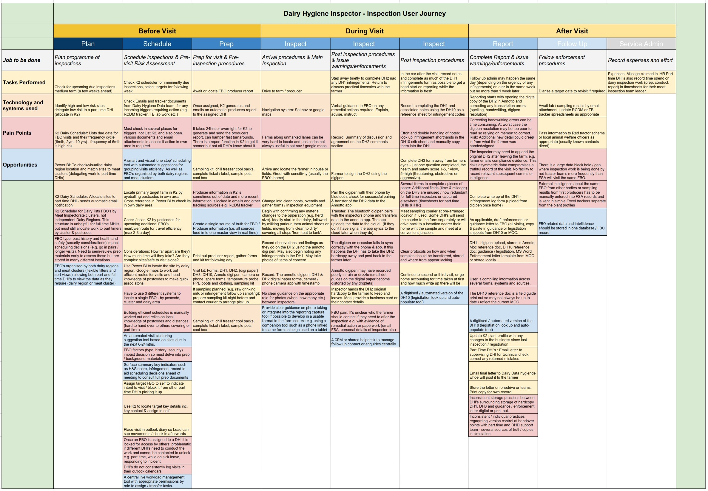

## User Journey 

## Dairy Inspection Observations

- Dairy Inspectors enjoy an autonomous role with clear responsibility for a region with the support of part time DHIs
- Inspection context (dairy farms) do not vary significantly from each other, so inspection needs are broadly consistent.
- The inspection 'flow' follows the most developed and consistent/ repeatable 'flow' of the three domains, though all could emulate it.
- Positive team structure and hierarchy, the most effective of the 3 domains;
- Effective balance of full vs. part time roles and 2 types of leader (1 technical, 1 senior) but still reliant on sharing part time MHIs with others
- More consistency in ways of working across DHIs owing to a dedicated technical leader role
- Reporting tools are more formalised, consistent and efficient than in other inspection areas (DH2)
- DH2 acts in triple duty as an inspection guide or prompt, as well as a recording and reporting tool in one.
- The digipen provides a semi-digitised solution, while retaining flexibility of paper to switch easily between sections
- Expectations of replacement tech (tablets) are vague but high, instant results assumed (risky without contextual co-design)
- Plenty of poor and inconsistent practices persist around file naming, data storage and retention where tooling allows these omissions.
- DHI core digital skills are no more advanced than other inspection teams but doing the role full time speeds up learning
- DHIs also benefit from more consistent tools and processes that promote consistency and repeatability, compensating for some less developed digital skills.

## User Needs

- [Common to Inspectors](personas-and-user-needs#inspector-needs)
- [Dairy Inspectors](personas-and-user-needs#dhi-needs)
- [Lead Inspectors](personas-and-user-needs#lead-needs)