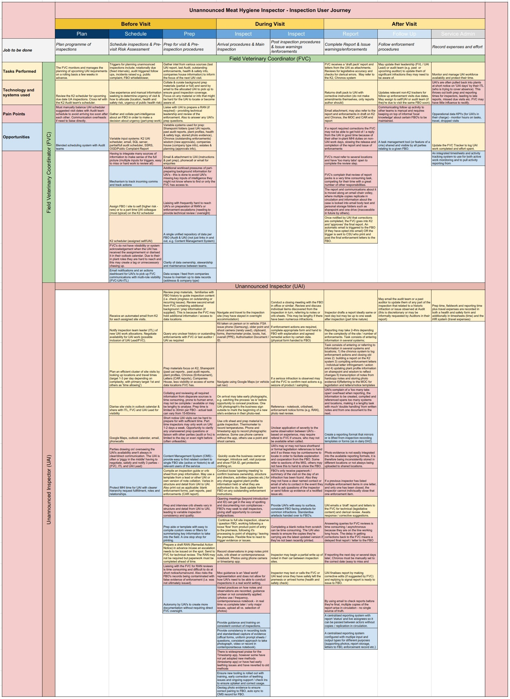

## User Journey 

## Unannounced Inspections Observations

- UAI is resourced and task managed very differently to Dairy
  - Many more roles involved in sharing one inspection cycle for a given FBO
  - ‘Too many cooks’ all trying to share one pot.
- The core tasks, steps and user needs are broadly consistent
- Tooling for scheduling, preparing, recording and reporting is complex
  - Much more distributed. “Several tabs open for one task” to cross reference
  - Duplication of effort occurs in the ‘should be’ as is.
  - Workarounds have proliferated a large suite of tools, hacks or extra steps
- UAIs are not office based digital natives
  - Large cognitive loads in managing simple administrative tasks due to tools.
  - Hard to get in touch with, time in competition with MHI roles.
  - Part time = slower learning curve and less opportunity to be self reliant
- FVCs are shouldering a large burden of coordination and supervision
  - May result in ‘human index card’ / knowledge font as they juggle several actors.
  - They have other roles competing for their attention

##  User Needs

- [Common to Inspectors](personas-and-user-needs#inspector-needs)
- [Unannounced Inspectors](personas-and-user-needs#uai-needs)
- [Lead Inspectors](personas-and-user-needs#lead-needs)

