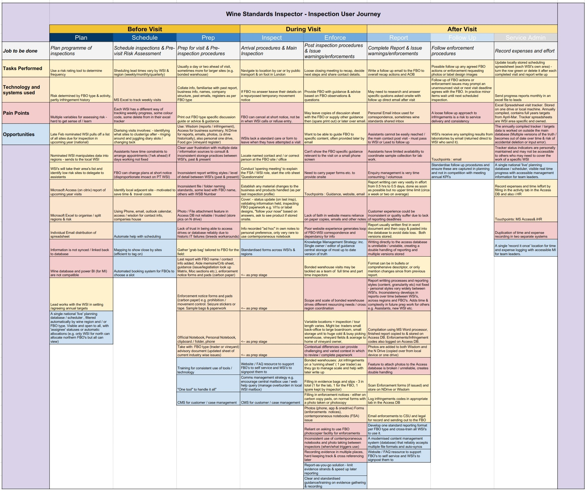

## Wine Inspection User Journey

## Wine Inspection Observations

- Wine is as an inspection service has a much broader context of inspection locations
  - Variety of FBO types and premises attracting different challenges & regulation content
- The core tasks, steps and user needs are broadly consistent
  - Preparing, conducting, recording, reporting and follow up are consistent
- Tooling is rudimentary but closest to ‘complete’ in one tool (scheduling, reporting etc.) but...
- Extraction of Management Information is very manual
  - Reliant on WSI practices being consistent and tech being compatible
- Lack of consistent approaches to data storage and retention
  - Frustrating the tasks of prep & compromising data completeness and retention.
  - Suffers “Several tabs open for one task” to cross reference
- Digital literacy potential and adoption of new tooling is mixed
- WSIs are shouldering a large burden of technical leadership and coordination
  - May result in inconsistency in preferred ways of working if none are mandatory
- Reliance on part time assistants produces unique challenges due to planned nature
  - Part time = harder to book in appointments / react to ITL resourcing shortages
- Wine FBO’s more likely to seek guidance and the Inspector to provide an information service

## User Needs

- [Common to Inspectors](personas-and-user-needs#inspector-needs)
- [Wine Inspectors](personas-and-user-needs#wsi-needs)
- [Lead Inspectors](personas-and-user-needs#lead-needs)